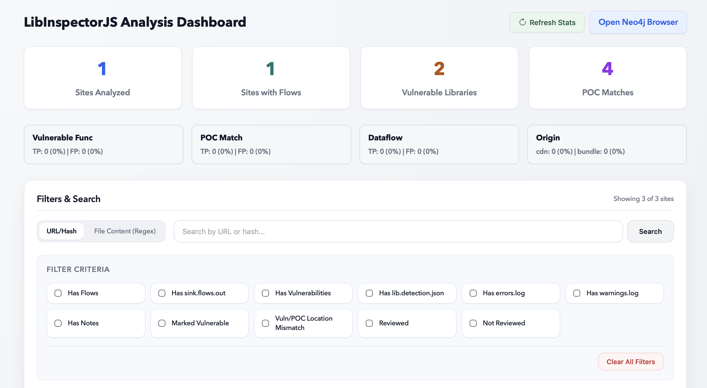
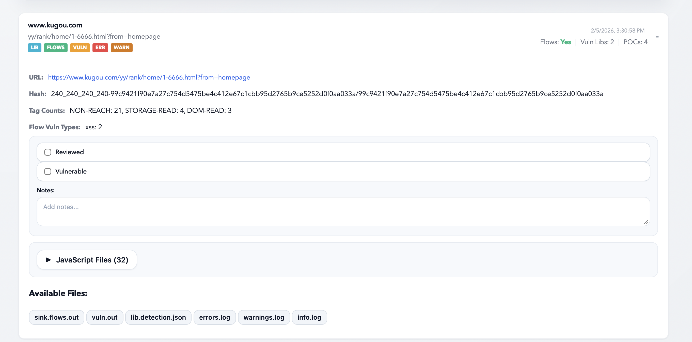
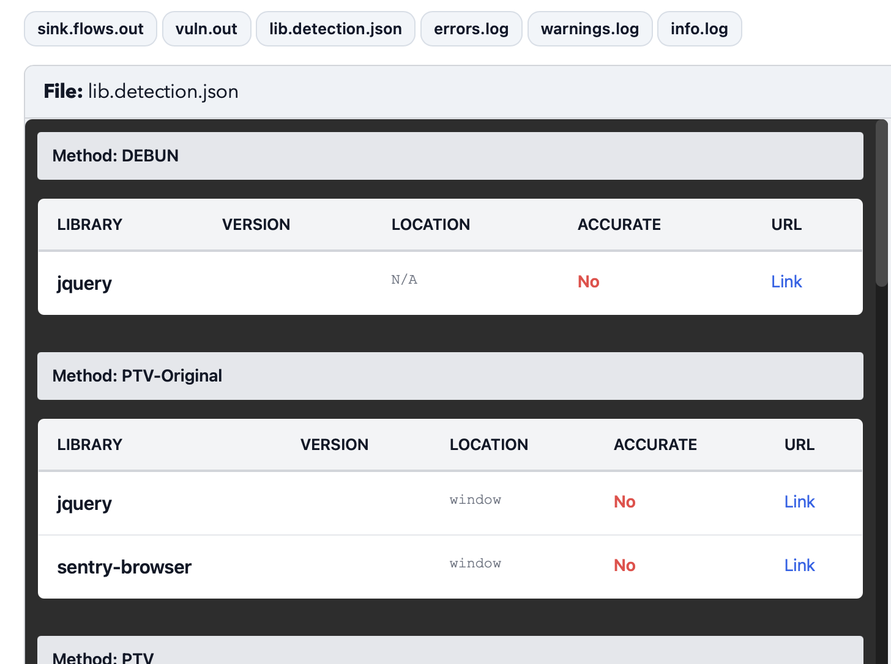
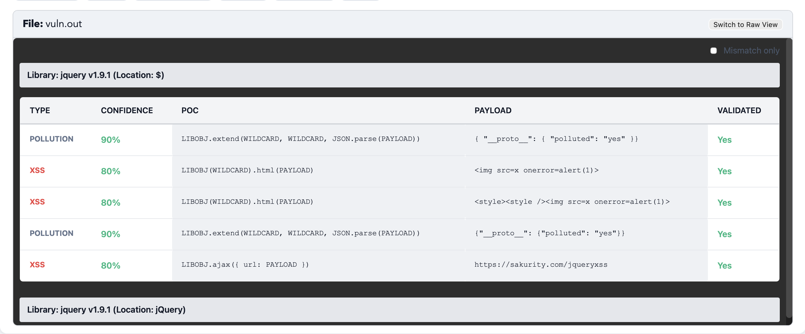
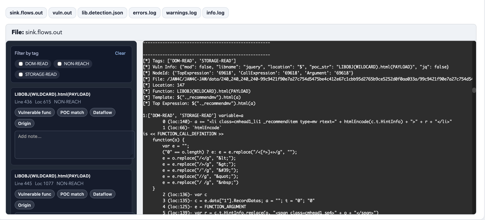

# You Import, They Exploit: Measuring JavaScript Library Exploitability on the Web

This artifact evaluates LibInspectorJS, a scalable pipeline that measures the vulnerable library functions and exploitability on the web. 


# Overview

JavaScript libraries such as jQuery and Lodash are a core
component of the modern web development stack. However,
prior work has shown that websites frequently rely on out-
dated libraries, many of which contain publicly known vul-
nerabilities. LibInspectorJS is a end-to-end pipeline that:

1. Detects vulnerable libraries, including in bundled code, by lifting and analyzing them for identifying features
2. Pinpoints exploitable functions using a new tag-tainting algorithm to match non-standard sinks
3. Evaluates exploitability
through automated data-flow analysis from user-controlled inputs.


# Running the full pipeline (including setting up DB/archive)
### Setting up docker image and running the full pipeline
```
curl <the zip link to this artifact> -o JAW4C.zip
mkdir JAW4C && mv JAW4C.zip JAW4C/ && cd JAW4C && unzip JAW4C.zip && chmod +x ./JAW4C-WebArchive/entrypoint.sh
```
```
docker compose -p 'artifact' up --build
```
This should be executed in the JAW4C directory, it will set up the python environment and the required docker services 

The default configuration will analyze the archived websites in `JAW4C/JAW4C-WebArchive/archive`, with the indexing file located at `JAW4C/JAW4C-WebArchive/archive/name_mapping.json`
After the analysis, you should be able to see the analysis results in `JAW4C-JAW/data` directory

# Inspecting the outcome with UI 
We provide a simple web-based UI to inspect the analysis results, to run the UI, run the following command in another terminal:
```
docker compose -f JAW4C-UI/docker-compose.yml up --build
```
Navigate to localhost:3001 in your web browser to access the UI.



The stats for each site can be shown by clicking on the site entry:


Click on lib.detection.json/vuln.out/sink.flows.out to see the detailed analysis results:

### Library Detection Results


### Vulnerability Query Results


### POC Matching and Data Flows


# Manually inspecting the pipeline
If you want to manually inspect the pipeline, you can replace the command field of the 'logic' service in docker-compose.yml with a keep-alive command such as:
```
sh -c "while [ 1 ]; do echo '' > /dev/null; done"
```
Then you can exec into the container:
```
# This runs the full pipeline
docker exec artifact-logic-1 sh -c "python3 -m run_pipeline --conf=/JAW4C/JAW4C-JAW/config_docker.yaml"
```
```
# This runs a test my spawning a small web server and crawling against it
docker exec artifact-logic-1 sh -c "cd tests/pipeline_test && python3 test_run.py --action analysis --test integration_test/static_analysis/test_jq_CVE-2020-7656 --config=/JAW4C/JAW4C-JAW/config_docker.yaml"
```

# Anonymous Submission notes
Since this paper uses publicly available tools, including 
JAW(https://www.google.com/url?sa=t&source=web&rct=j&opi=89978449&url=https://github.com/SoheilKhodayari/JAW&ved=2ahUKEwiZvvTemMOSAxXwFVkFHZ8sPKgQFnoECB0QAQ&usg=AOvVaw3xduNS2xjJY2tBwfcttOwb), PTV(https://github.com/aaronxyliu/PTV), DEBUN(https://github.com/ku-plrg/debun-ase25). 
There are some segment in code that includes copyright notices. We've anoymized those parts for the purpose of review process but would restore them once the whole process is done.

# Evaluation logs -- Library usages

Total sites analyzed: 10,462
Total libraries detected (unique): 31,080
Libraries (unique) per site (average): 2.97

Top 10 most used libraries:
 1. jquery                        : 7,892
 2. core-js                       : 5,215
 3. react                         : 4,675
 4. lodash.js                     : 2,662
 5. jqueryui                      : 1,577
 6. underscore.js                 : 1,567
 7. preact                        : 1,529
 8. bootstrap                     : 1,209
 9. moment.js                     : 1,154
10. vue                           : 936

# Evaluation logs -- Vulnerable Library usages

Total sites with vulnerabilities: 3,810
Total vulnerable libraries detected: 6,562
  (Note: Takes into account multiple vulnerable versions of the same library on a single site)
Vulnerable libraries per site (average): 1.72

Top 10 vulnerable libraries:
 1. jquery                        : 2,009
 2. lodash.js                     : 1,696
 3. moment.js                     : 401
 4. gsap                          : 231
 5. handlebars.js                 : 159
 6. require.js                    : 152
 7. dompurify                     : 148
 8. axios                         : 111
 9. bootstrap                     : 82
10. highlight.js                  : 67

Vulnerability types distribution:
  xss       : 696
  redos     : 8
  pollution : 6
  sanitization: 5

# Evaluation logs -- poc match 

POC Matches (All):
  Total POC matches (including non-reach): 21,012
  Sites with POC matches: 967
  Average POC matches per site (all sites): 2.01

POC Matches (With Flows):
  Total POC matches : 2,202
  Sites with POC matches: 405
  Average POC matches per site (all sites): 0.21


# JAW copyright notice
-- JAW is a opensource project, we moved the original copyright notice to a separate file in the JAW4C-JAW directory, which is the part of the code that is directly used in the pipeline. The original copyright notice is as follows:
Copyright (C) 2022  Soheil Khodayari, CISPA
This program is free software: you can redistribute it and/or modify
it under the terms of the GNU Affero General Public License as published by
the Free Software Foundation, either version 3 of the License, or
(at your option) any later version.
This program is distributed in the hope that it will be useful,
but WITHOUT ANY WARRANTY; without even the implied warranty of
MERCHANTABILITY or FITNESS FOR A PARTICULAR PURPOSE.  See the
GNU Affero General Public License for more details.
You should have received a copy of the GNU Affero General Public License
along with this program.  If not, see <http://www.gnu.org/licenses/>.
